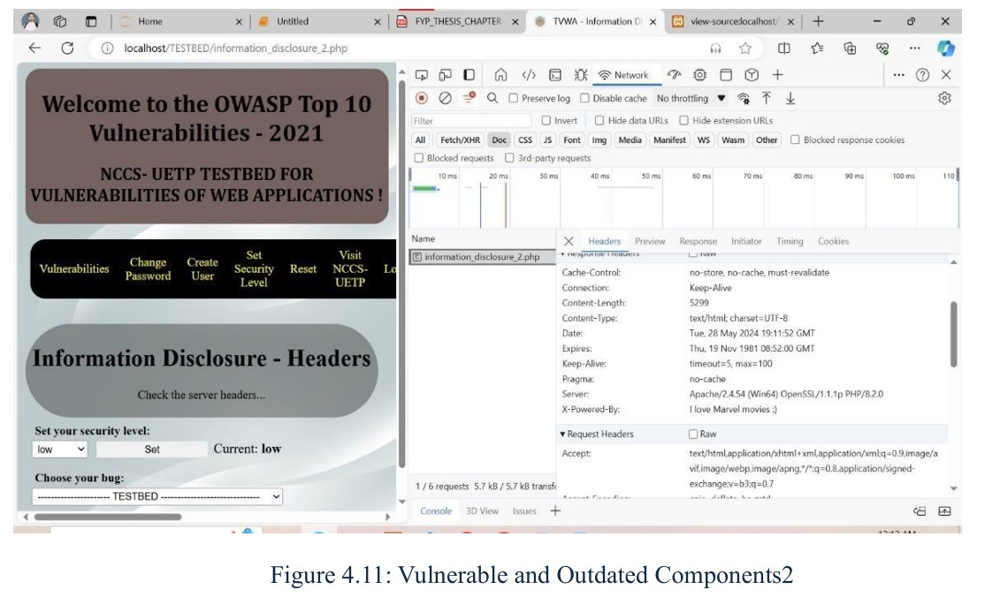
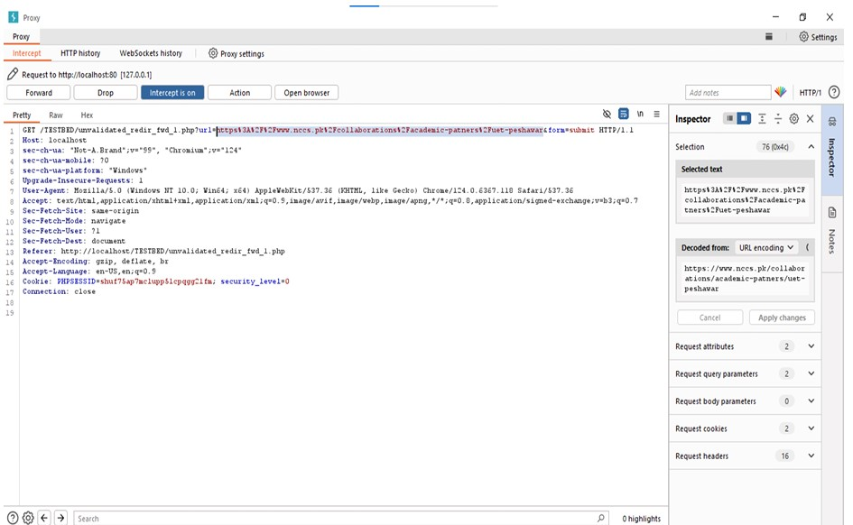
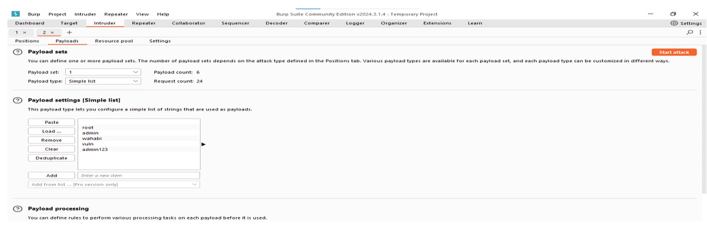
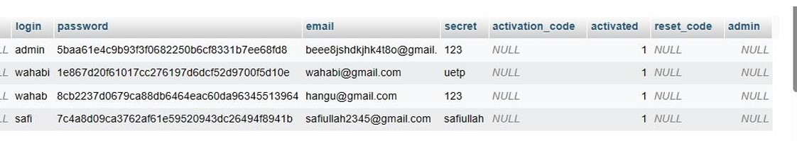

# NCCS-UETP Testbed for Web Applications Vulnerabilities

## Overview

The NCCS-UETP Testbed for Web Applications Vulnerabilities project addresses the critical need for updated and accessible training materials in web application security. The existing OWASP training materials, which have remained unchanged since 2013-2017, have resulted in a significant gap in preparing individuals and organizations for the evolving landscape of web security challenges. This stagnation has led to a shortage of expertise amid the increasing number of cyber threats, consequently raising the risk for organizations' web-based systems and data.

## Project Goals

To combat this issue, our project aims to develop a comprehensive testbed with user-friendly training modules focused on identifying, analyzing, and mitigating web application vulnerabilities. By providing practical skills and knowledge, we aim to empower individuals and organizations to effectively secure web applications in the face of modern threats.

## Key Objectives

Develop updated and practical training resources for web application security.
Provide a user-friendly testbed for hands-on practice and learning.
Equip individuals and organizations with the skills to identify and mitigate web application vulnerabilities.
Contribute to a more secure online environment and a better-prepared workforce in the field of web application security.

## Project Screenshots

## Benefits

Through this initiative, we aspire to contribute to a more secure online environment and a better-prepared workforce in the field of web application security. By offering updated and practical training resources, we aim to mitigate the risk posed by web application vulnerabilities and enhance overall cybersecurity practices.

## Contact

For access to the source code or any further information, please contact us at [safimohmand34@gmail.com](mailto:safimohmand34@gmail.com).

